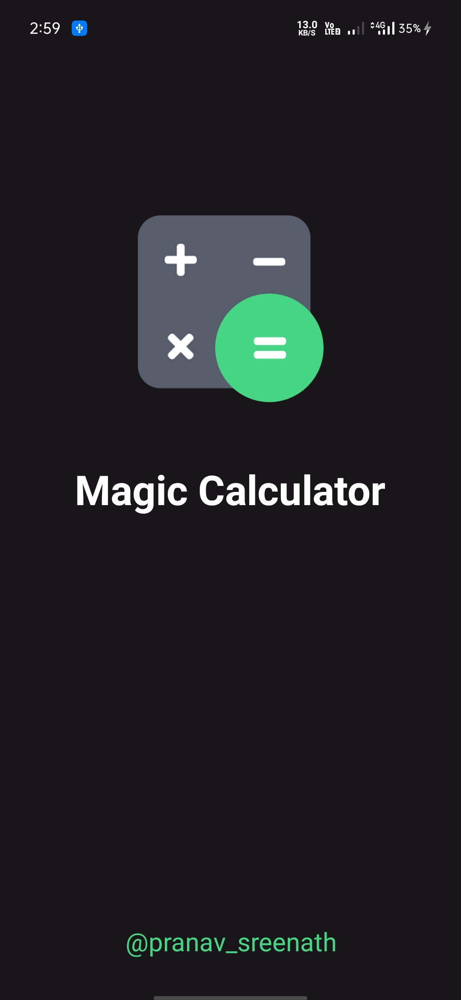
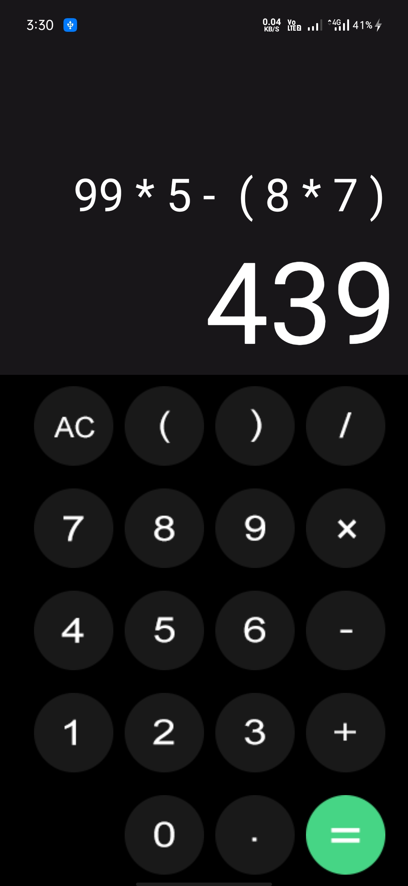
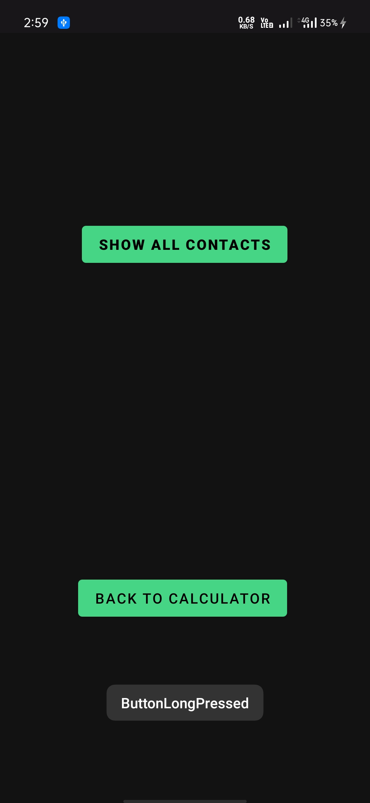
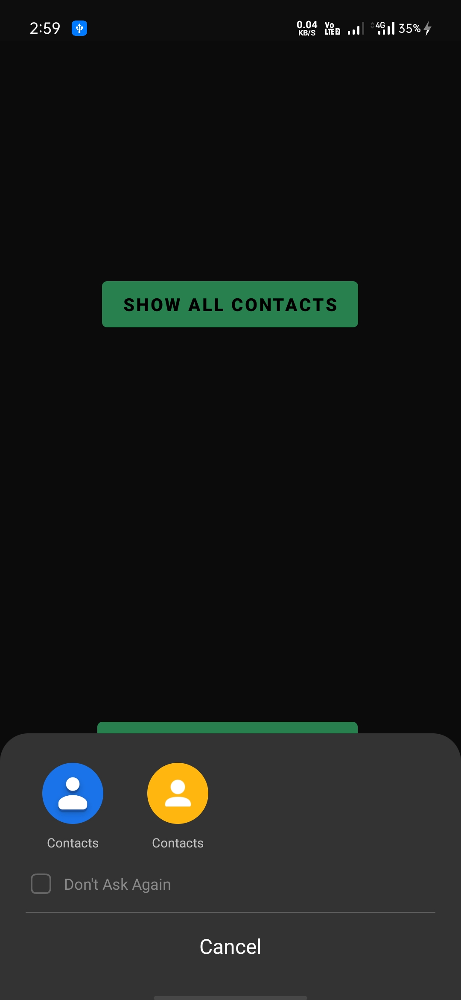
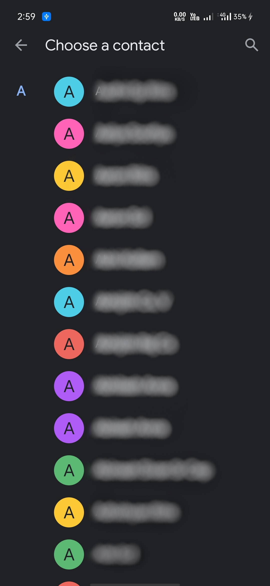

# Magic-Calculator

A **fun calculator** with basic functions and a **pranking** feature

[Download this app in PLAY STORE](https://play.google.com/store/apps/details?id=com.project_one.calculator)

To learn trick, watch this video [Made My First App in 7 Days](https://youtu.be/7Pal5lSGR90)
It has some really cool features.
- Long Press '=' sign and click on the Show contacts button to explore additional settings.
- Select your contact no of your friend that you want to prank and go back to calculator.
- Now as you press '=' sign the phone no you selected will be displayed

This is an open-source project and Contains no ads or unnecessary permissions so feel free to **fix bugs**.

## Screenshorts

## MIT License

